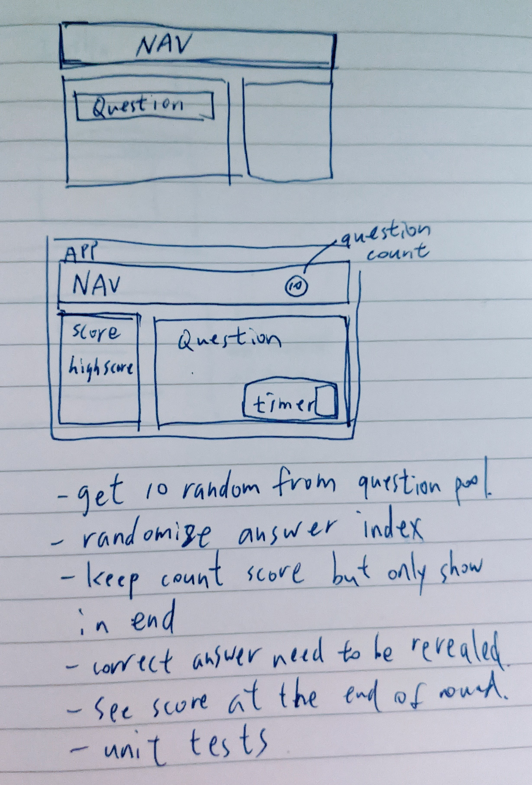

# Tandem Code Challenge 2020

## Description

This is a trivia app for the Tandem apprenticeship challenge! For more detail please reference [Tandem Challenge](./Tandem_SEApprentice_Challenge_2020.pdf).

### Development process

I am currently learning react-native for a side project, so I decided to use react for this challenge! I started by figuring out the basics of building a react app from [this video](https://www.youtube.com/watch?v=Ke90Tje7VS0&ab_channel=ProgrammingwithMosh):

Before coding, I drew a simple layout (F1) and made sure I covered the challenge criteria. One important feature I added to the app was shuffling the multi-choices so the they won't be in the same order every time you play the game.

(F1):

For this version I only implemented the question box portion, and plan to improve it with timer, ability to add questions, compare with other players, etc. After playing and testing the app a few times I also thought this can be a very useful app to practice exams!

I didn't have a lot of experience with testing, but always knew it was important in the development cycle. Upon reading [tips](https://madeintandem.com/blog/preparing-tandems-apprenticeship-code-challenge-interview/) from past apprentices, I used the [react testing library](https://testing-library.com/docs/react-testing-library/intro) to experiment and getting a better understanding of how testing works.

### Launching the app on localhost

npm version: `npm@6.14.8`
`npm install`
`npm start`
